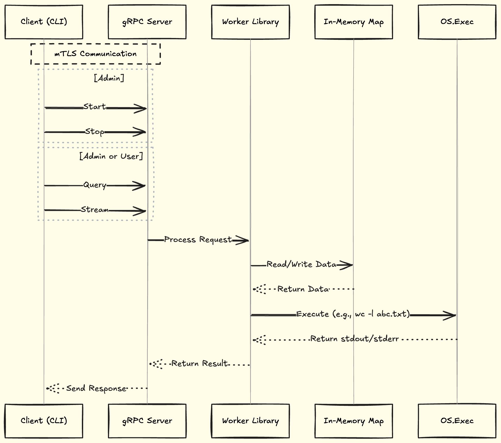
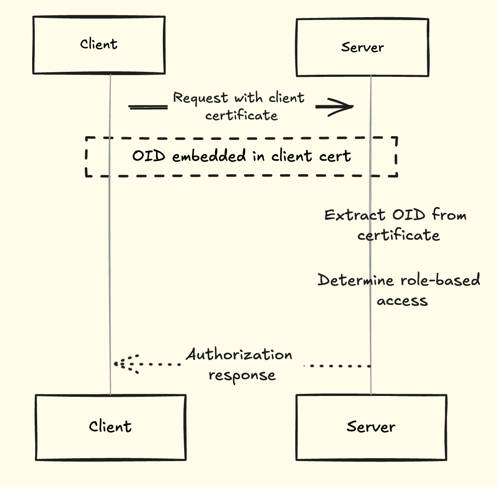

# Summary

* Implement a prototype job worker service that provides an API to run arbitrary Linux processes.

# Functional requirements

* https://github.com/gravitational/careers/blob/main/challenges/systems/challenge-1.md#level-4

# Job management 
* All the jobs details since the start of the server will be stored in memory.
```json
{
    "e17980c1-cbdc-46f9-a302-cf39b8bba501": {
        "status": "running|exited|signaled",
        "pid": 123,
        "exit_code": "EXIT_CODE_INT",
        "signal": "SIG_CODE_INT",
        "logs": [
            "foo happened at start",
            "bar thereafter after 1 sec",
            "...."
        ]
    }
}
```
* Start & Stop command: Go's os/exec will be utilized specifically [exec.Command](https://pkg.go.dev/os/exec#Command) for Start/Stop command and gather information on process and signal status. Exit code or signal info on job's end of execution will be captured and stored till server's lifetime.
* Query: This would be a inmemory lookup on the jobID
* Stream: All the logs since the start of process execution and all the real time updates will be streamed to connected clients. A possible implementation would be 
```
1. Maintain a map of job IDs to channels that receive new logs.
2. When a streaming request is received, create a new channel if one does not already exist for the job ID.
3. Write new logs to both the channel and the in-memory map of job details, ensuring that logs are stored and streamed simultaneously.
4. The server listens to this channel for new log entries.
5. Maintain a map of streaming clients associated with each job ID to track which clients are streaming logs for a particular job.
6. Broadcast log entries from the channel to all connected streaming clients associated with the job ID.
```

# Architecture diagram



# API 

* Refer to the [proto spec](../service/proto/jobworker.proto).

# CLI interface

1. Start
```
./worker-service start -command "sort" "largefile.txt -o sortedfile.txt"
example output: job with id 761db04c-0150-4f0b-a6fd-5cab9b9a48bf started.
```
2. Stop
```
./worker-sevice stop 761db04c-0150-4f0b-a6fd-5cab9b9a48bf
Output: Success! job with id 761db04c-0150-4f0b-a6fd-5cab9b9a48bf stopped.
```
3. Query
```
./worker-service query 761db04c-0150-4f0b-a6fd-5cab9b9a48bf
Output: job with id 761db04c-0150-4f0b-a6fd-5cab9b9a48bf [is running|has stopped].
```
4. Stream
```
./worker-service stream 761db04c-0150-4f0b-a6fd-5cab9b9a48bf
Output: 
2024-08-26T14:35:21Z [INFO] Server started on port 8080
2024-08-26T14:35:22Z [DEBUG] foo bar
2024-08-26T14:35:23Z [ERROR] bar foo
2024-08-26T14:35:24Z [WARN] High memory usage with foo as bar
2024-08-26T14:35:25Z [INFO] bar is foo now.
......
......
```

# Authentication
* Communication between client and server will be with mutual TLS i.e both needs to verify their identity. 
* Use openssl to generate certificates. A certificate authority will sign all the clients and server cert.

# Authorization
* Role based authorization: Control access based on user roles.
    1. Only 2 roles - Admin and User.
    2. Admin can do all operations permitted  
        1. Start, stop, query and stream  
        2. Start the process with the resource limits - CPU, memory and disk only.
    3. User can only query and stream 
* Implementation:
    * 2 client certs with embedded OIDs (object identifiers) will be generated using openssl. This approach ties authentication (who you are) directly to authorization (what you're allowed to do).
    * The server can make authorization decisions based on the role OID in the client certificate.


# TLS Setting
* Although TLS 1.2 is [still widely used](https://www.ssllabs.com/ssl-pulse/), transitioning to TLS 1.3 can mitigate future compatibility issues with legacy clients. TLS 1.3 provides several benefits including [a faster handshake, Perfect Forward Secrecy (PFS) and zero round-trip time (0-RTT)](https://www.rfc-editor.org/rfc/rfc8446.html#section-1.2), all of which enhance security and possibly performance in streaming scenarios. 
* For this project, we will mandate the use of TLS 1.3 for all clients. As per docs [here](https://pkg.go.dev/crypto/tls@master) and [here](https://go-review.googlesource.com/c/go/+/314609), TLS 1.3 automatically handles cipher suite selection. Below is the sample server code configured to support only TLS 1.3:

```go
creds := credentials.NewTLS(&tls.Config{
	MinVersion:   tls.VersionTLS13, // Enforce TLS 1.3
	MaxVersion:   tls.VersionTLS13, // Enforce TLS 1.3
	Certificates: []tls.Certificate{cert},
	ClientCAs:    caCertPool,
	ClientAuth:   tls.RequireAndVerifyClientCert,
})
```

# Certs for mTLS
* All certs will be created with key size of 4096 bits using RSA.
* SHA-256 will be used as a hashing algorithm for signing certs.
* CA and server certs will be valid for 365 days whereas a shorter validity period (45 days) will be provided for client certs. This is to emphasize rotation and renewal. 

# Resource Limiting Strategy
* The optimal approach to setting resource limits is to monitor the current system load and enforce limits dynamically when the load average exceeds a threshold. Unix tools located under `/proc/` can provide this system load information.
* For this project, a time-based resource scheduling strategy will be implemented. This strategy will adjust resource limits according to peak and off-peak hours, ensuring that resources are allocated more efficiently during high-demand periods.
* The following limits will be applied:
```
cpu-limit: 512 (half of the CPU share)
memory-limit: 500M
disk-limit: 500
```
* After a job completes or is terminated, the associated cgroup will be cleaned up to reclaim resources and prevent system clutter.

# Out of scope
* State of job will not persist after restarts i.e no persistent storage such as log files or local sqllite database.

# Non-functional requirements
* Security: Should pass vulncheck
* Race conditions: Should pass the race detector test