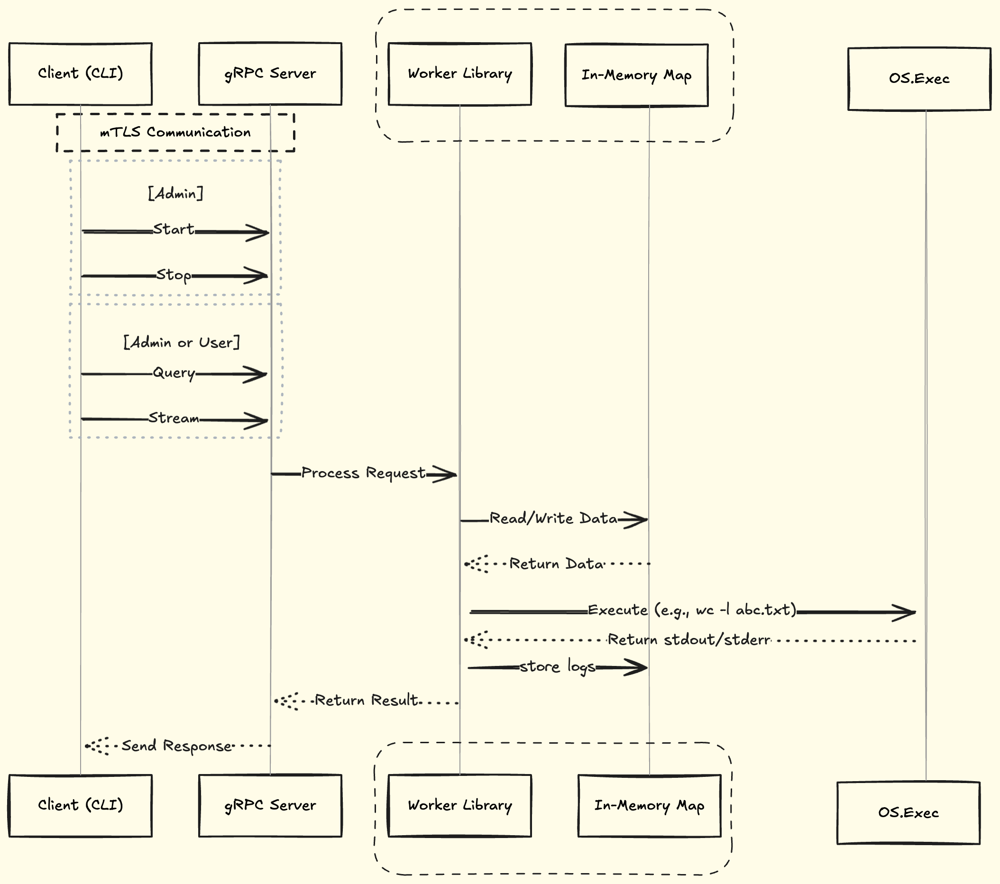

# Summary

* Implement a prototype job worker service that provides an API to run arbitrary Linux processes.

# Functional requirements

* https://github.com/gravitational/careers/blob/main/challenges/systems/challenge-1.md#level-4

# Job management 
* All the jobs details since the start of the server will be stored in memory.
```json
{
    "e17980c1-cbdc-46f9-a302-cf39b8bba501": {
        "status": "running|exited|signaled",
        "pid": 123,
        "exit_code": "EXIT_CODE_INT",
        "signal": "SIG_CODE_INT",
        "logs": [
            "foo happened at start",
            "bar thereafter after 1 sec",
            "...."
        ]
    }
}
```
* Start & Stop command: Go's os/exec will be utilized specifically [exec.Command](https://pkg.go.dev/os/exec#Command) for Start/Stop command and gather information on process and signal status. Exit code or signal info on job's end of execution will be captured and stored till server's lifetime.
* Query: This would be a inmemory lookup on the jobID

# Streaming gRPC: Handling high volume log generation with multiple clients
* gRPC Flow Control: While gRPC provides HTTP/2 flow control, additional configurations may be required to handle high log generation volumes and multiple clients subscribing to the same log stream.

1. Stream Initialization:
    1. When a stream request is made, the server should first send the client all existing logs up to that point in time.
    2. Create a buffered channel for real-time logs if one doesn’t already exist for the job. This channel helps prevent overwhelming the client by regulating the flow of new log entries.
    3. The server listens on the buffered channel and streams logs to the client in real-time.
    4. Handling Client Disconnections:
         1. Use keepalive settings: Send pings every 10 minutes. Wait for ack for 20 sec. Timeout after 30 mins of inactivity.
2. Handling Burstable Logs:
    1. This design can accommodate bursty logs by using buffered channels to regulate log flow to clients.
3. Enhancements (Nice-to-Have Features):
    1. Ring Buffer for Logs:
        * For jobs producing a high volume of stdout/stderr, the client may be overwhelmed by the sheer volume of existing logs before it catches up to real-time logs.
        * A ring buffer that holds the most recent X log entries can mitigate this, allowing the client to receive the latest logs without being flooded by the backlog.
    2. Buffer Management for High Data Volumes:
        * Maintain a buffer per client on the server to accumulate logs.
        * Periodically flush the buffer either at fixed intervals (e.g., every second) or when a certain number of entries are accumulated.
    3. Limiting Active Clients: Set a maximum number of concurrent active clients on the server. If the server reaches capacity, return an error to new clients (e.g., "Max capacity reached").
    4. Test and configure server options can be configured including 
        1. Initial window size: This is for each individual stream. Amount that can be snet without waiting for ack.
        2. Connection window size. This governs all of the connection, regardless how many are active. 
        3. Set MaxConcurrentStreams appropriately. 
        4. MaxSendMsgSize (Max message size a server can send)
4. Client considerations:
    1. Use context timeouts so if the server does not respond, it can close the connection. (Note: Reconnection is nice to have but out of scope for this exercise)

# Architecture diagram



# API 

* Refer to the [proto spec](../service/proto/jobworker.proto).

# CLI interface

1. Start
```
./worker-service start -command "sort" "largefile.txt -o sortedfile.txt"
example output: job with id 761db04c-0150-4f0b-a6fd-5cab9b9a48bf started.
```
2. Stop
```
./worker-sevice stop 761db04c-0150-4f0b-a6fd-5cab9b9a48bf
Output: Success! job with id 761db04c-0150-4f0b-a6fd-5cab9b9a48bf stopped.
```
3. Query
```
./worker-service query 761db04c-0150-4f0b-a6fd-5cab9b9a48bf
Output: job with id 761db04c-0150-4f0b-a6fd-5cab9b9a48bf [is running|has stopped].
```
4. Stream
```
./worker-service stream 761db04c-0150-4f0b-a6fd-5cab9b9a48bf
Output: 
2024-08-26T14:35:21Z [INFO] Server started on port 8080
2024-08-26T14:35:22Z [DEBUG] foo bar
2024-08-26T14:35:23Z [ERROR] bar foo
2024-08-26T14:35:24Z [WARN] High memory usage with foo as bar
2024-08-26T14:35:25Z [INFO] bar is foo now.
......
......
```

# Authentication
* Communication between client and server will be with mutual TLS i.e both needs to verify their identity. 
* Use openssl to generate certificates. A certificate authority will sign all the clients and server cert.

# Authorization
* Role based authorization: Control access based on user roles.
    1. Only 2 roles - Admin and User.
    2. Admin can do all operations permitted  
        1. Start, stop, query and stream  
        2. Start the process with the resource limits - CPU, memory and disk only.
    3. User can only query and stream 
* Implementation:
    * 2 client certs with embedded OIDs (object identifiers) will be generated using openssl. This approach ties authentication (who you are) directly to authorization (what you're allowed to do).
    * The Admin OID `1.3.6.1.4.1.12345.1.1` is included in config file [here](../certs/cnf/admin.cnf)
    * The User OID `1.3.6.1.4.1.12345.1.2` is included in config file [here](../certs/cnf/user.cnf)
    * The server can make authorization decisions based on the role OID in the client certificate.


# TLS Setting
* Although TLS 1.2 is [still widely used](https://www.ssllabs.com/ssl-pulse/), transitioning to TLS 1.3 can mitigate future compatibility issues with legacy clients. TLS 1.3 provides several benefits including [a faster handshake, Perfect Forward Secrecy (PFS) and zero round-trip time (0-RTT)](https://www.rfc-editor.org/rfc/rfc8446.html#section-1.2), all of which enhance security and possibly performance in streaming scenarios. 
* For this project, we will mandate the use of TLS 1.3 for all clients. As per docs [here](https://pkg.go.dev/crypto/tls@master) and [here](https://go-review.googlesource.com/c/go/+/314609), TLS 1.3 automatically handles cipher suite selection. Below is the sample server code configured to support only TLS 1.3:

```go
creds := credentials.NewTLS(&tls.Config{
	MinVersion:   tls.VersionTLS13, // Enforce TLS 1.3
	MaxVersion:   tls.VersionTLS13, // Enforce TLS 1.3
	Certificates: []tls.Certificate{cert},
	ClientCAs:    caCertPool,
	ClientAuth:   tls.RequireAndVerifyClientCert,
})
```

# Certs for mTLS
* All certs will be created with key size of 4096 bits using RSA.
* SHA-256 will be used as a hashing algorithm for signing certs.
* CA and server certs will be valid for 365 days whereas a shorter validity period (45 days) will be provided for client certs. This is to emphasize rotation and renewal. 

# cgroup

1. Create a new cgroup directory with a name that includes the <jobid_uuid> to ensure uniqueness.
2. Since cgroups are mounted as a filesystem, get the file descriptor of that directory
3. Set the CPU, memory, and I/O weight limits for the cgroup using the respective files (cpu.max, memory.max, and io.weight).
```
cpu-limit using cpu.max: 50000 // 50% of 1 core.
memory-limit using memory.max: // 100 MB
io-weight using io.weight: 500 (1-1000). Higher means higher priority for disk I/O
```
4. Use the SysProcAttr struct to specify that the new process should be started in the cgroup associated with the file descriptor. This ensures that the process is started in the correct cgroup before start without needing to write its PID to cgroup.procs which leaves a small window where the process can run unconstrained before being constrained by cgroup settings.
5. Start the process using exec.Command.Start().
6. After the job completes or is terminated, clean up the associated cgroup to prevent system clutter.

# Out of scope
* State of job will not persist after restarts i.e no persistent storage such as log files or local sqllite database. 
    Other than easing load on the server, persistent storage would have several benefits including:
    1. Allowing new clients to request past logs without needing a ring buffer if there's a high volume of log generation by a particular job.
    2. Implement a mechanism to replay logs from a specific point, enabling clients to catch up on missed entries.

# Non-functional requirements
* Security: Should pass vulncheck
* Race conditions: Should pass the race detector test
